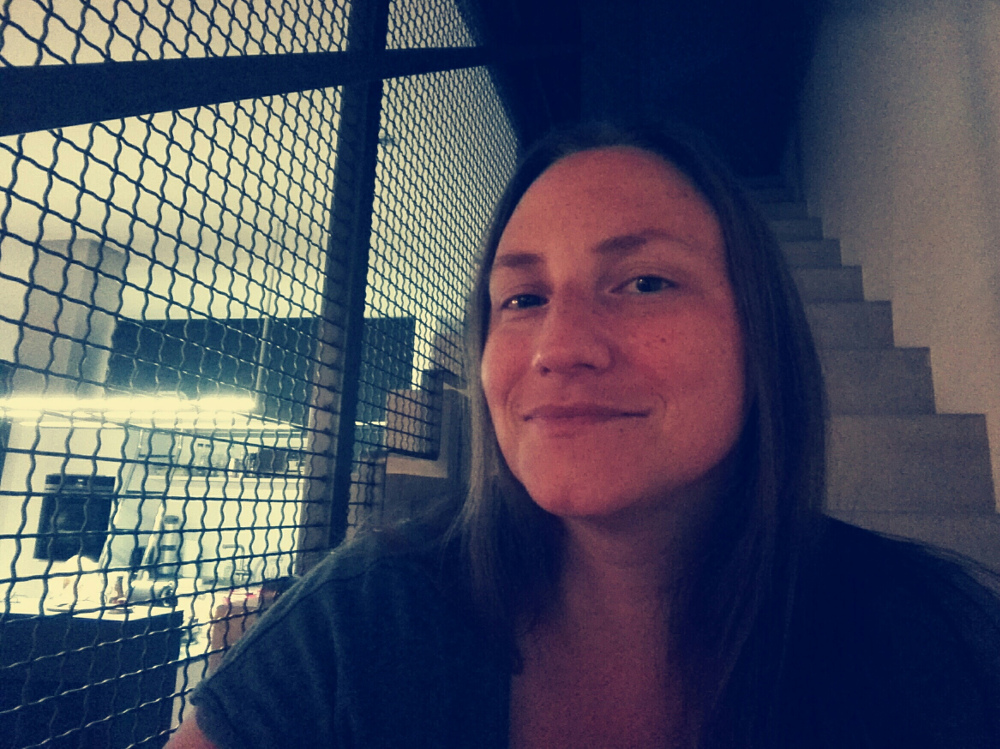

Title: Contact
Heading: SMEERWS
Subheading: Logik bringt dich von A nach B. Deine Phantasie bringt dich überall hin. (Albert Einstein)
Template: contact

Hallo, mein Name ist Susanne Meerwald-Stadler. Ich bin gerade dabei mich als Extended Reality Entwicklerin (Virtual Reality, Augmented Reality, Mixed Reality) selbstständig zu machen. In den letzten Jahren war ich in der Forschung tätig mit dem Schwerpunkt Robotik und User Experience (UX). Auf der Suche nach neuen Interface-Ansätzen für Roboter bin ich mit Augmented Reality das erste Mal in Berührung gekommen. Seither lässt mich die Faszination rund um virtuelle Welten in jeglicher Ausprägung nicht mehr los. Neben der technischen Entwicklung solcher Systeme habe ich die Malerei, das Skizzieren und Modellieren für mich entdeckt. Natürlich alles virtuell. Meine Arbeitsmaterialien sind mein Rechner, meine VR-Brille und das entsprechende Programm und der Kreativität sind keine Grenzen gesetzt.  

Neben der Malerei in der virtuellen Welt habe ich auch meine Leidenschaft zur Malerei in der "realen" Welt wiederentdeckt. Dabei arbeite ich mit Acryl auf Leinwänden, bzw. allem was sich sonst noch so anbietet. Auch dieses Jahr freue ich mich wieder auf mein alljährliches Seminar im Stift Reichersberg von gehalten von Renate Moran: Großflächige experimentelle Malerei, im Stift Reichersberg Acryl und Mischtechnik. 

