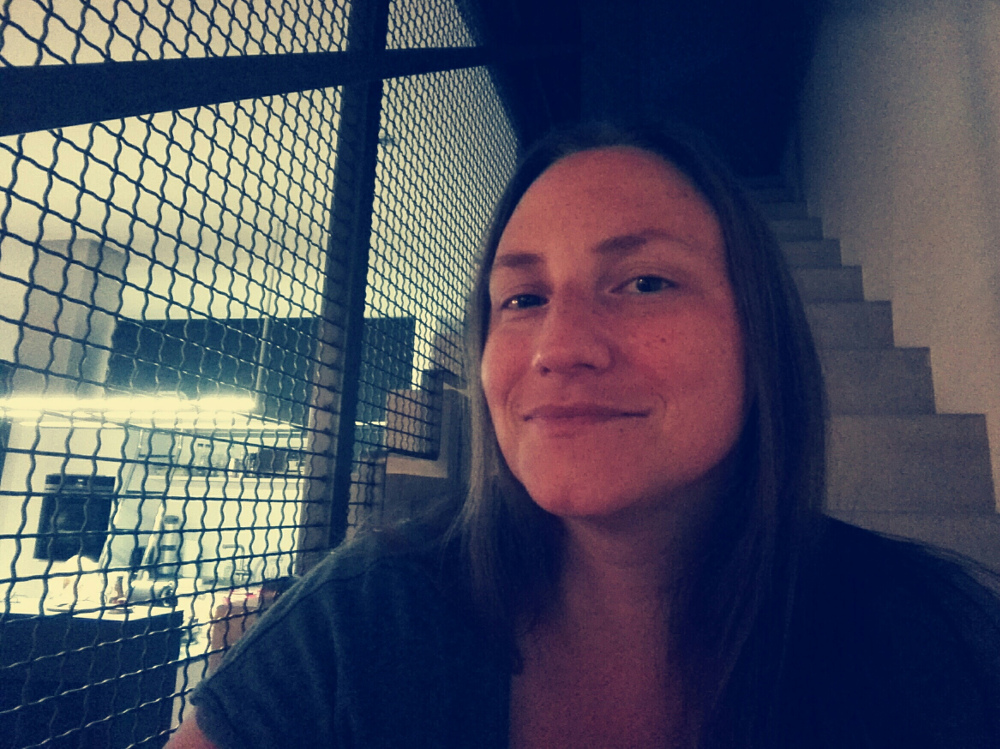

Title: Über Mich
Heading: SMEERWS
Subheading: Logik bringt dich von A nach B. Deine Phantasie bringt dich überall hin. (Albert Einstein)
Template: contact

Hallo, mein Name ist Susanne Meerwald-Stadler. Ich bin gerade dabei mich als Extended Reality Entwicklerin für Virtual Reality (VR), Augmented Reality (AR) und Mixed Reality (MR) selbstständig zu machen. In den letzten Jahren war ich in der Forschung tätig mit dem Schwerpunkt Robotik und User Experience (UX). Auf der Suche nach neuen Interface-Ansätzen für Roboter bin ich mit AR das erste Mal in Berührung gekommen. Seither lässt mich die Faszination rund um virtuelle Welten in jeglicher Ausprägung nicht mehr los. Neben dem Design und der Entwicklung solcher Systeme habe ich die Malerei, das Skizzieren und Modellieren in dieser virtuellen Welt für mich entdeckt. Meine Arbeitsmaterialien sind mein Rechner, meine VR-Brille und das [entsprechende VR-Programm](./vr-werkzeuge.html).

Neben der Malerei in der virtuellen Welt habe ich auch meine Leidenschaft zur Malerei in der "realen" Welt wiederentdeckt. Dabei arbeite ich mit Acryl bzw. Mischtechnik auf Leinwänden. Jedes Jahr ein Highlight das [Seminar](http://www.stift-reichersberg.at/veranstaltung/grossflaechige-experimentelle-malerei-h2023.html) "Großflächige experimentelle Malerei, im Stift Reichersberg Acryl und Mischtechnik" von [Renate Moran](http://www.renate-moran.at/). 

Susanne Meerwald-Stadler

Schießstandstrasse 3a, A-5061 Salzburg / AUSTRIA

Mobile: 0676 7354716
