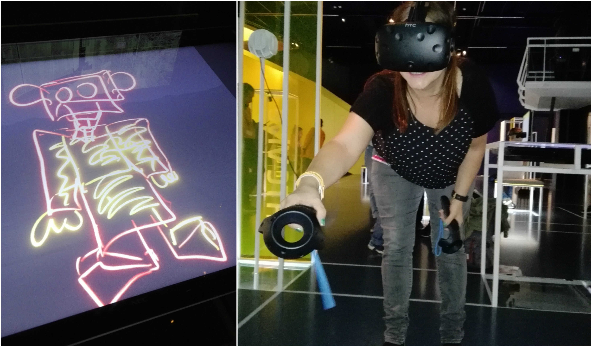
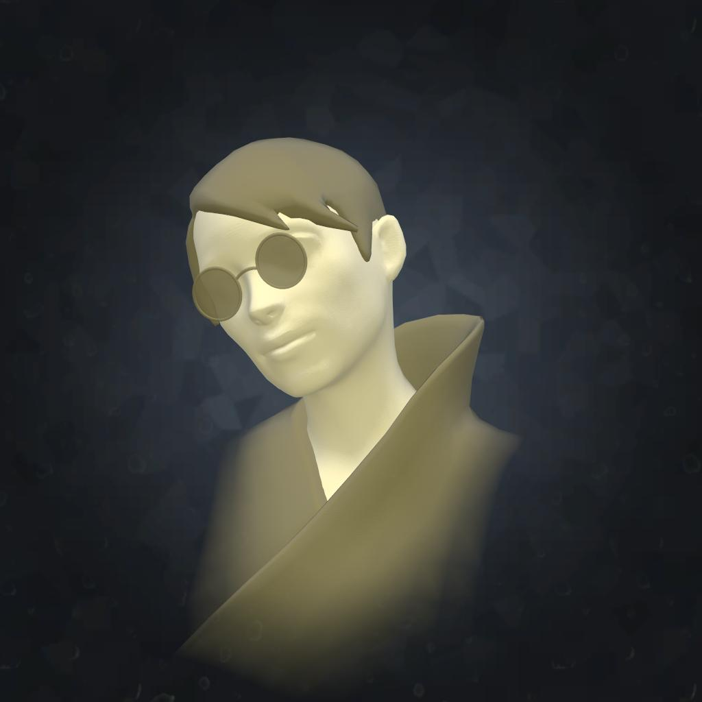
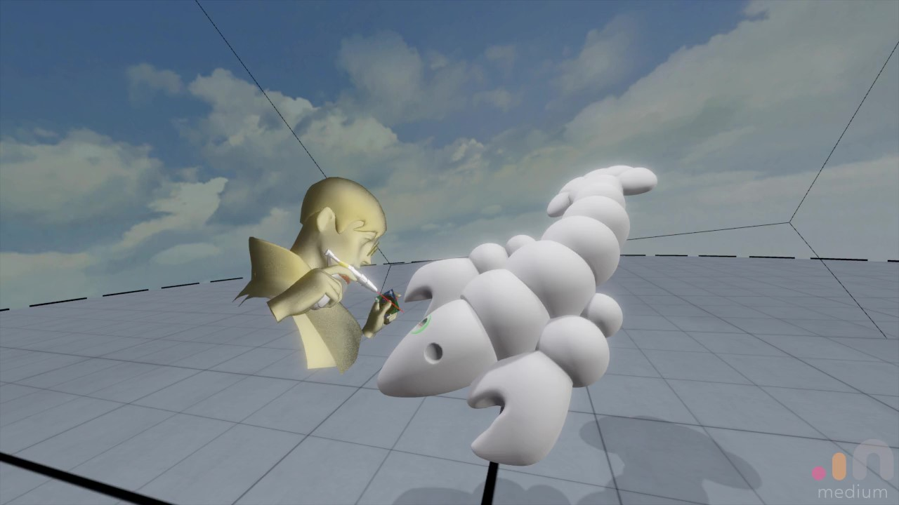

Title: VR Werkzeuge
Heading: Virtual Realtiy Werkzeuge
Template: landing

**Oculus Rift**: Die Oculus Rift ist ein sogenanntes Head-Mounted Display (HMD). Die Brille wurde von Oculus VR entwickelt und von Facebook im Jahr 2014 übernommen. Die Brille zeichnet sich durch ein gutes Preis/Leistungsverhältnis aus (ca. 500 Euro). 

**Rechner**: Zusätzlich zur Brille braucht man auch einen leistungsstarken Rechner. Die Minimalanforderungen für die Oculus bzw. Vive sind (stand 2017) eine gute Grafikkarte, mindestens einen i5-4590 Prozessor haben, mit mind. 8 GB Ram ausgestattet sein und  genügend USB Anschlüsse haben (Kostenpunkt > 1000 Euro).  

Programme: 

* Malen: [Tilt Brush](https://www.tiltbrush.com/)

* Illustrieren: [Quill](https://quill.fb.com/)

* Modellieren: [Oculus Medium](https://www.oculus.com/medium/), [Google Blocks](https://vr.google.com/blocks), [MasterpieceVR](https://www.masterpiecevr.com/), [Gravity Sketch](https://www.gravitysketch.com)

